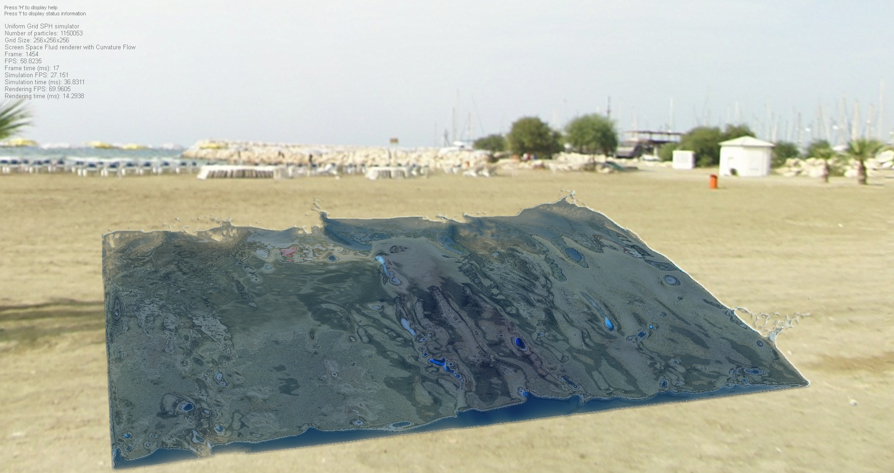

# What is this project ?

This program is part of my master's thesis which concerns real-time fluid
simulation using OpenCL and OpenGL.

# Dependancies

  - **OpenCL 1.2** to provide GPU acceleration for simulation part of the program
  - **OpenGL 3.3** for visualising simulation output
  - **Qt 5.4** to provide rendering surface and other goodies (like resources embedded
    in executable, loading OpenGL extensions and context creation, ...)
  - **Boost.Compute**, which simplifies work with OpenCL API and provides some handy
    parallel algorithms (like sorting)

# How to compile and run ?

  - To compile the project you can use the provided qmake file, which can be used
    directly by typing `qmake` followed by `make` on command line or from Qt Creator.
  - Program execution can be tweaked by additional command line arguments:

      - `-particle-count <number-of-particles>`
           determines the number of particles that will be used for simulation in mode 1
           `<number-of-particles>` is an integer representing the number of particles

      - `-grid-size <dimensions>`
           determines dimensions of the uniform grid that is used for neighbour search acceleration
           `<dimensions>` is a string in format `WIDTHxHEIGHTxDEPTH`, where WIDTH, HEIGHT
           and DEPTH are integer numbers determining respectively the width, the height
           and the depth of the specified uniform grid (these numbers **must** be powers of 2)
           Another option is to write `-grid-size SIZE`, where again SIZE is an integer
           power of 2 determining the size of the uniform grid. In this case, the width,
           the height and the depth of the uniform grid are all set to SIZE.

      - `-benchmark`
           when specified, this option runs the program in command line mode and
           performs a comprehesive suite of stress tests to evaluate its performance
           for a variety of uniform grid and particle count settings.
           Beware that this option will make the program run for quite a while and
           may significantly load your system.

      - `-benchmark-rendering`
           this is a smaller set of stress tests, that will run several iterations
           of the main program loop and print simple statistics on the time spent
           simulating and rendering the fluid for given particle count and grid size
           settings.
           This option also makes the program run without creating a window.

# Features

  - simulation is done using Smoothed Particle Hydrodynamics
  - rendering is done using Screen Space Fluid Rendering with Curvature Flow
  - with proper hardware (in my case Radeon R9 280X, Intel Core i5 4690K, 8GB of RAM)
    and latest drivers (in my case Catalyst 15.7.1), the program is capable
    of simulating over 1,000,000 particles at around 30-40 FPS (depending on how
    is the fluid spread across the domain) and over 4,000,000 particles at
    about 8-12 FPS. These numbers are including full-fledged visualization.
    
# Screenshots

